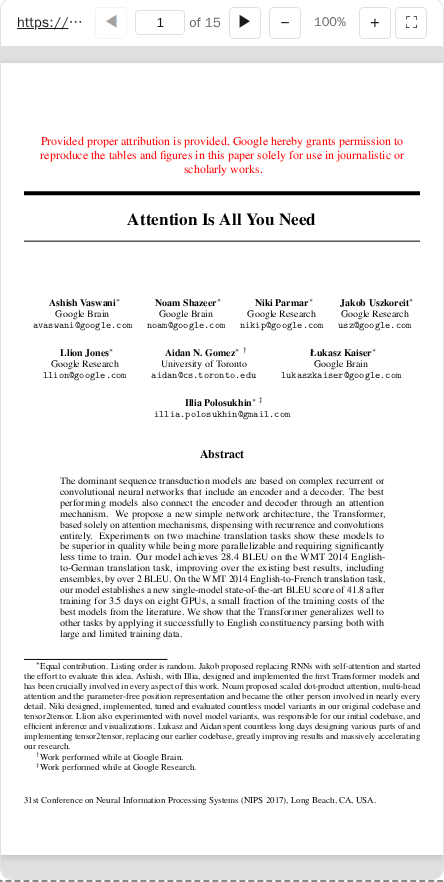

# PDF Server



An interactive PDF viewer using [PDF.js](https://mozilla.github.io/pdf.js/). Supports local files and remote URLs from academic sources (arxiv, biorxiv, zenodo, etc).

## MCP Client Configuration

Add to your MCP client configuration (stdio transport):

```json
{
  "mcpServers": {
    "pdf": {
      "command": "npx",
      "args": [
        "-y",
        "--silent",
        "--registry=https://registry.npmjs.org/",
        "@modelcontextprotocol/server-pdf",
        "--stdio"
      ]
    }
  }
}
```

### Local Development

To test local modifications, use this configuration (replace `~/code/ext-apps` with your clone path):

```json
{
  "mcpServers": {
    "pdf": {
      "command": "bash",
      "args": [
        "-c",
        "cd ~/code/ext-apps/examples/pdf-server && npm run build >&2 && node dist/index.js --stdio"
      ]
    }
  }
}
```

## What This Example Demonstrates

### 1. Chunked Data Through Size-Limited Tool Calls

On some host platforms, tool calls have size limits, so large PDFs cannot be sent in a single response. This example streams PDFs in chunks using HTTP Range requests:

**Server side** (`server.ts`):

```typescript
// Returns chunks with pagination metadata
{
  (bytes, offset, byteCount, totalBytes, hasMore);
}
```

**Client side** (`mcp-app.ts`):

```typescript
// Load in chunks with progress
while (hasMore) {
  const chunk = await app.callServerTool("read_pdf_bytes", { url, offset });
  chunks.push(base64ToBytes(chunk.bytes));
  offset += chunk.byteCount;
  hasMore = chunk.hasMore;
  updateProgress(offset, chunk.totalBytes);
}
```

### 2. Model Context Updates

The viewer keeps the model informed about what the user is seeing:

```typescript
app.updateModelContext({
  content: [
    {
      type: "text",
      text: `PDF viewer | "${title}" | Current Page: ${page}/${total}\n\nPage content:\n${pageText}`,
    },
  ],
});
```

This enables the model to answer questions about the current page or selected text.

### 3. Display Modes: Fullscreen vs Inline

- **Inline mode**: App requests height changes to fit content
- **Fullscreen mode**: App fills the screen with internal scrolling

```typescript
// Request fullscreen
app.requestDisplayMode({ mode: "fullscreen" });

// Listen for mode changes
app.ondisplaymodechange = (mode) => {
  if (mode === "fullscreen") enableScrolling();
  else disableScrolling();
};
```

### 4. External Links (openLink)

The viewer demonstrates opening external links (e.g., to the original arxiv page):

```typescript
titleEl.onclick = () => app.openLink(sourceUrl);
```

### 5. View Persistence

Page position is saved per-view using `viewUUID` and localStorage.

### 6. Dark Mode / Theming

The viewer syncs with the host's theme using CSS `light-dark()` and the SDK's theming APIs:

```typescript
app.onhostcontextchanged = (ctx) => {
  if (ctx.theme) applyDocumentTheme(ctx.theme);
  if (ctx.styles?.variables) applyHostStyleVariables(ctx.styles.variables);
};
```

## Usage

```bash
# Default: loads a sample arxiv paper
bun examples/pdf-server/main.ts

# Load local files (converted to file:// URLs)
bun examples/pdf-server/main.ts ./docs/paper.pdf /path/to/thesis.pdf

# Load from URLs
bun examples/pdf-server/main.ts https://arxiv.org/pdf/2401.00001.pdf

# Mix local and remote
bun examples/pdf-server/main.ts ./local.pdf https://arxiv.org/pdf/2401.00001.pdf

# stdio mode for MCP clients
bun examples/pdf-server/main.ts --stdio ./papers/
```

## Allowed Sources

- **Local files**: Must be passed as CLI arguments
- **Remote URLs**: arxiv.org, biorxiv.org, medrxiv.org, chemrxiv.org, zenodo.org, osf.io, hal.science, ssrn.com, and more

## Tools

| Tool             | Visibility | Purpose                                |
| ---------------- | ---------- | -------------------------------------- |
| `list_pdfs`      | Model      | List available local files and origins |
| `display_pdf`    | Model + UI | Display interactive viewer             |
| `read_pdf_bytes` | App only   | Stream PDF data in chunks              |

## Architecture

```
server.ts      # MCP server + tools
main.ts        # CLI entry point
src/
└── mcp-app.ts # Interactive viewer UI (PDF.js)
```

## Key Patterns Shown

| Pattern           | Implementation                              |
| ----------------- | ------------------------------------------- |
| App-only tools    | `_meta: { ui: { visibility: ["app"] } }`    |
| Chunked responses | `hasMore` + `offset` pagination             |
| Model context     | `app.updateModelContext()`                  |
| Display modes     | `app.requestDisplayMode()`                  |
| External links    | `app.openLink()`                            |
| View persistence  | `viewUUID` + localStorage                   |
| Theming           | `applyDocumentTheme()` + CSS `light-dark()` |

## Dependencies

- `pdfjs-dist`: PDF rendering (frontend only)
- `@modelcontextprotocol/ext-apps`: MCP Apps SDK
